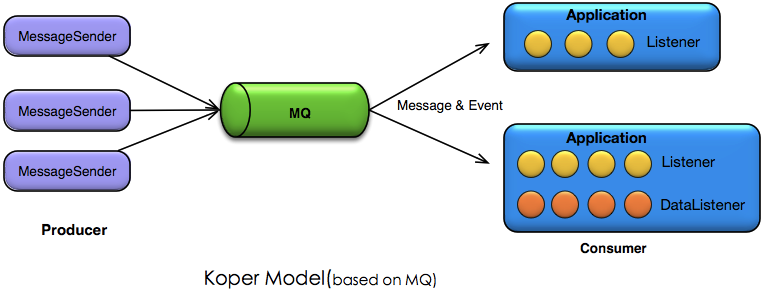

# Koper
 Koper is a MQ-based and event-driven distributed framework.
 * Koper provides a simplified distributed listener and data listener model,which can help you build your aync application in a quick and simple way.
 
# Concept 
 * Core architecture:  Message Architeture， Event Driven Architecture（EDA）
 * Core concept:       producer, consumer, message, Message Queue(MQ), topic, subscribe
 * Core component:     MessageSender, MessageListener, DataEventListener.
 * High-level concept: consumer group, message partition




# Feature
 *  A simplified MQ-based listener model and API.
 *  A simplified Data Event model and API.
 *  MQ provider independent. Koper supports Kafka, RabbitMQ or other message queue as provider.
 *  High performance and throughput.
 *  High extensibility.
 *  High-level feature: time spot recording, message sourcing
 
# Programming Demo

## 1. Listener Model
  Member signup example.
 ``` java
 @Component
 public class MemberSignupListener extends AbstractMessageListener {

    @Autowired
    private SmsService smsService;

    @Listen(topic = "com.zhaimi.message.demo.message.notifyMemberAfterSignup")
    public void onMessage(String msg) {
        smsService.sendSms(msg);
    }
    
 }
 ```

## 2. Data Event Model
 Order example.
 ``` java
 @Component
 @DataListener(dataObject = "com.zhaimi.message.demo.dataevent.dao.impl.OrderMapperImpl")
 public class OrderListener {

    public void onInsertOrder(Order order) {
        System.out.println("orderNo : " + order.getOrderNo());
        System.out.println("create time : " + order.getCreatedTime());
        // do some data analysis
    }

    public void onUpdateOrder(Order order) {
        System.out.println("orderNo : " + order.getOrderNo());
        System.out.println("create time :" + order.getCreatedTime());
        // do some data analysis
    }
    
 }
 ```
