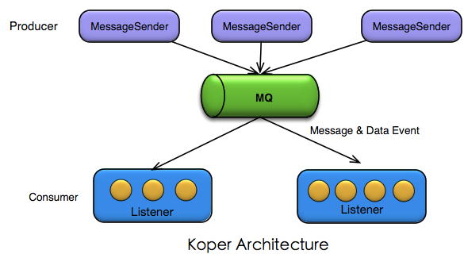

# Koper
 Koper is a MQ-based and event-driven distributed framework.
 * Koper provides a simplified distributed listener and data listener model,which can help you build your aync application in a quick and simple way.
 
# Concept 
 * Core architecture:  Message Architeture， Event Driven Architecture（EDA）
 * Core concept:       producer, consumer, message, Message Queue(MQ), topic, subscribe
 * Core component:     MessageSender, MessageListener, DataEventListener.
 * High-level concept: consumer group, message partition




# Feature
 *  Simplified MQ-based listener model and API.
 *  Simplified Data Event model and API.
 *  MQ provider independent. Koper supports Kafka by default, but also supports other message queue as provider, e.g.  RabbitMQ, RocketMQ.
 *  High performance and throughput.
 *  High scalability.
 *  High extensibility.
 *  High-level feature: time spot recording, message sourcing
 
# Programming Demo

### 1. Listener Model
  Member signup example.
 ``` java
 @Component
 public class MemberSignupListener extends AbstractMessageListener {

    @Autowired
    private SmsService smsService;

    @Listen(topic = "com.zhaimi.message.demo.message.notifyMemberAfterSignup")
    public void onMessage(String msg) {
        smsService.sendSms(msg);
    }
    
 }
 ```

### 2. Data Event & Data Listener Model
 Order example.
 ``` java
 @Component
 @DataListener(dataObject = "com.zhaimi.message.demo.dataevent.dao.impl.OrderMapperImpl")
 public class OrderListener {
    // data event: onInsertOrder
    public void onInsertOrder(Order order) {
        System.out.println("orderNo : " + order.getOrderNo());
        System.out.println("create time : " + order.getCreatedTime());
        // do some other operations
    }
    //data event: onUpdateOrder
    public void onUpdateOrder(Order order) {
        System.out.println("orderNo : " + order.getOrderNo());
        System.out.println("create time :" + order.getCreatedTime());
        // do some other operations such as cache refresh
    }
    
 }
 ```

# What can we do with Koper?
 Koper is designed to support distributed asynchornous programming based on Message Queue and Event Driven Ahchitecture. It's suitable for the following scenarios:
 * Internet Web Application, such as e-commerce, O2O, social media, finance, OA etc.
 * System analysis, such as log anaysis, anti-attack, throttling
 * Data analysis & process, real-time business index computation,  business alarm
 * Other distributed computation cases.
 
 To see more message programming scenarios and examples, goto [Async Scenarios andexamples](https://github.com/ZhaimeGroup/koper/wiki/Async-Scenarios-and-examples)

# Contribute other MQ provider
 Koper provides a Kafka provider implementation by default. Because of its high scalability, you can implement other MQ provider easily,such as RabbitMQ, RocketMQ, ActiveMQ etc.
 
 

 For examele, if you need to integrated with legacy RabbitMQ, you just need implement 
 ```RabbitSender``` and ```RabbitReceiver```.
 Refer to the source code of Kafka provider for more details. [KafkaSender](), [KafkaReceiver]().
 
